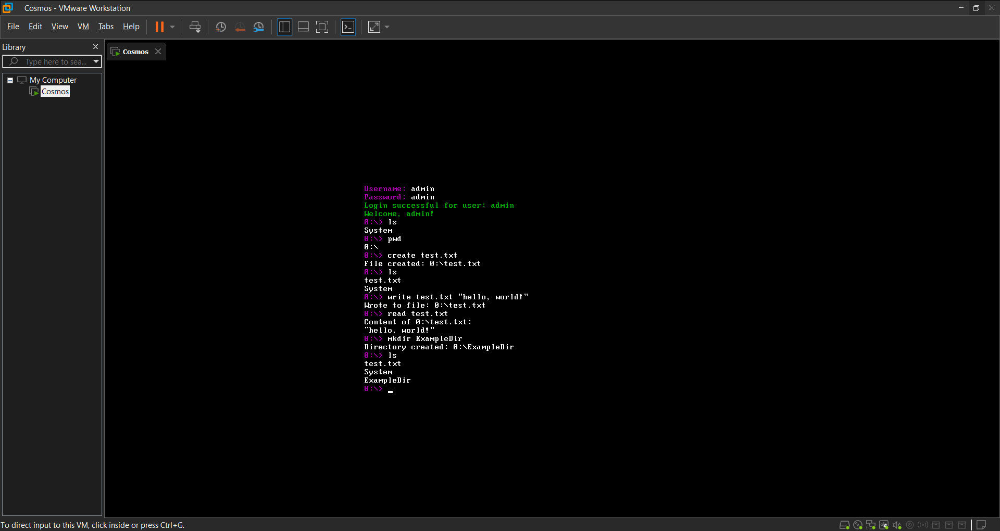
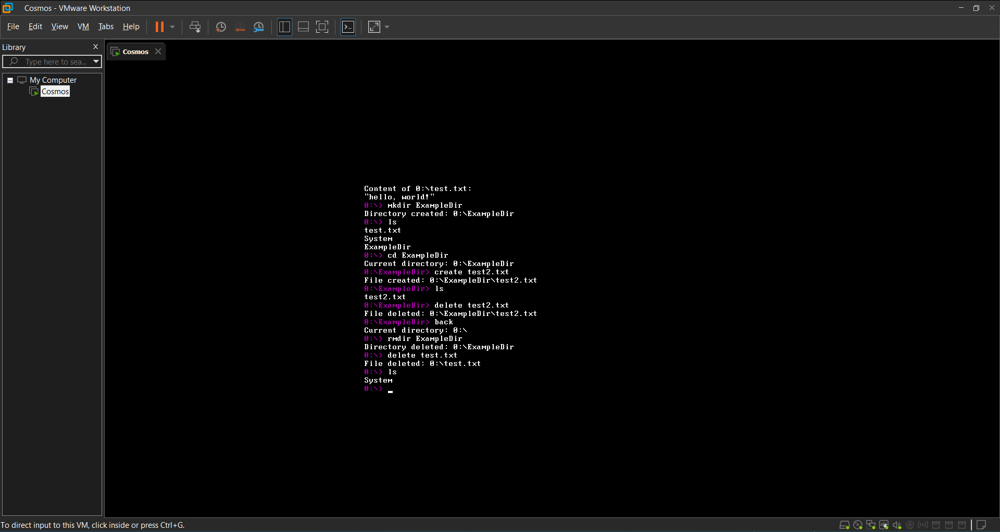

# TheSailOS

## Overview

TheSailOS is an operating system built using C# and the Cosmos (C# Open Source Managed Operating System) framework. This project aims to provide a learning experience in OS development, exploring various aspects such as kernel design, file system management, networking, process management, and user interface.

## Features

- **File System:**
    - Custom virtual file system (VFS)
    - Support for file and directory operations (create, delete, read, write, copy, move, rename)
    - Disk management (format, partition, list partitions)

- **Networking:**
    - TCP/IP stack
    - DNS resolution
    - Ping utility
    - TCP and UDP client/server implementations

- **Command-Line Interface (CLI):**
    - Command history
    - Command aliasing
    - Built-in commands for file system, system, network, hardware, and process management

- **Applications:**
    - Text editor
    - Calculator
    - Simple games (Snake, Tetris, Tic-Tac-Toe)

- **Audio:**
    - Audio playback support

## Important Note: Version 0.0.1 - Alpha Stage

This is an early alpha release (version 0.0.1) of TheSailOS. As such, it is not feature-complete and may contain bugs, unstable components, and unimplemented features. Use with caution and be aware that data loss or system instability may occur.

## Default Credentials

For administrative access, use the following default credentials:

- **Username:** admin
- **Password:** admin

## Contributing

Pull requests are welcome. For major changes, please open an issue first to discuss what you would like to change.

## Author

Bohdan Harabadzhyu

## License

[MIT](https://choosealicense.com/licenses/mit/)